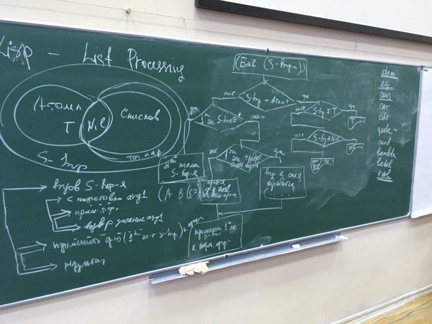

# Лекция 1
**список** - частный случай s выражения, список представляется своей списковой ячейкой

---
базис
* атомы 
* структуры, бинарные узлы

---
базисные функции:
* car
* cdr
* atom
* eq
* cons
* quote (или ~)
* cond
* lambda
* eval
* label

---
над базисом строятся простые формулы в виде списков где первый элемент - функция, остальные - ее аргументы, все остальные вычисления могут быть сведены к этому базису

---
## классификация функций
* чистые(строго математически) - фиксированныое кол-во аргументов, один результат
* специальные функци - способны обрабатывать аргументы нестандартным способом
* псевдо функци - осущесвтялют побочный эффект на аппаратуре(для печати, если нужны эффекты от внешних устройств) 
* функции допускающие вариантные значения - позволяют реализовывать логическое программирование
* функции высших порядков - используются для синтаксически управляемого конструирования программ 
* (рассматривается как особый способ работы функции) ленивые вычисления - сведение вызовы функции к представлению рецепта(правила) и вычисления (принцип лиспа - вычислять все в последний момент)

---
лисп является расширяемым языком - язык подстраивается под класс задач, можно выстроить специальные функции для удобства реализации. лисп предполагал что разработчики разработают свои функции и дальше пользователь сможет испльзовать существующие фукнции и следовательно не будет делать ошибок, но потом этот запрет на создание

---
## классификация математических функций(базисных)
* селекторы (car cdr) - аргументы обязательно списки, структуры которые представляются списком
* конструкторы - позволяют создавать структуры
  * cons - создает списковую ячейку, расставляя 2 указателя. имеет 2 аргумента. работает очень быстро
* предикаты - группа фукнции, позволяющих сравнивать, проверить природу своего аргумента. (все что не нил то тру)
  * atom - имеет 1 аргумент, отвечает Т(тру) только когда аргумент является атомом
  * consp - 1 аргумент, проверяет состоит ли структура из списковых ячеек
  * listp - 1 аргумент, проверяет является ли структура списком
  * null - проверяет список на пустоту
  * numberp - проверяет является ли атом числовым, если является, то можно сделать проверку на четность
  * oddp - проверяет на нечетность
  * evenp - проверяет на четсность

функция list - ??, позволяет создать список, произволное количество аргументов. организуе столько списковых ячеек сколько и аргументов.

базисные фукнции более эффективны в работе

базисные фукнции основаны на функции eq(сравнивает указатели на объекты, приманима только к символьным атомам, не применима к числам).

функции на основе eq(базисная функция, быстро работает потому что сравнивает 2 указателя)(это все тоже к предикатам):
* eql -то же самое что и eq + еще сравнивает числа и символьные атомы
  * eql 3.0 3.0 -> T
  * eql 3.0 3 -> nil
  * = 3.0 3 -> T
* equl ~ eql + списки 
---
## вычисление функции и выполнение программ на лисп, способы определения функции
(setf name value) - установить значение символьному атому. 

способ определения функции:
* (defun name (arg1, arg2, ...) ) - тело функции список, то есть s - выражение (форма)
    ```lisp 
    (defun average (x y) (/(+ x y) 2.0))
    ``` 
  
* лямбда нотация- способ определения функций без имени, (lambda (<список аргументов>) (<форма>))
    ```lisp 
    (lambda (x) (+ (* x x x) (* 3 x)))
    ```
* apply
    ```lisp
    (apply  #' average '(5 7)) -> 6.0
    (apply #'(lambda (x y) ( / (+ x y) 2.0)) '(5 7))
    ```
программа реализуется с помощью алгоритма встроенного в систему.
eval - запускается когда мы исполняем программу. автоматически когда набрали эс-выражение, нажали клавишу ввод, к выражению приписывается eval



# Лекция 2

**ТУТ ДОЛЖНА БЫТЬ ФОТКА ПРВЫХ 20 МИНУТ ЛЕКЦИИ**

## ПРЕДСТАВЛЕНИЕ В ПАМЯТИ СИМВОЛЬНЫХ АТОМОВ
символьный атом представляется в памяти 5-ю указателями:
* указатель на имя
* на значение 
* на функцию
* на свойство
* на пакет

---
пакет - список, в котором хранятся ссылки атомы, которые содержат какой-то смысл(содержательные атомы(атомы со значением)) 
---

## Специальные функции 
* cond - имеет в своем состояве произвольнок кол-во 2-х элементных списков 
* and - может быть произвольое кол-во аргументов, обрабатывает не все свои аргументы, а работает до тиех пор пока не будет очевиден рещультат 
* or 


# Лекция 3 04.03.2019

## работа со спиками как с множествами, работа с ассоциативыми таблицами 
множество - совокупность элементов без дублей, порядок элеметов не важен
функции unit, member, пересечение множеств
---

Ассоциативные таблицы:
* представляются в виде списка - список точечных пар, которые воспринимаются как ключ-значение ((k1 v1) (k1 v1))
* (assoc key table) - по ключу вернет точечную пару
* (rassoc value table) - вернет ключ по значению
* существуют функции, которые обрабатывают список как множество, то есть без дублей

## Функционалы 
это функции, которые в качестве аргумента принимает функциональные объект, то есть функцию

1) применяющие функционалы
   1)  (apply #'fun '(arg1 ...)) 
   2)  (funcall #'fun 'arg1 'arg2 )
2) отображающие функционалы - это функции применяют аргумент(аргумент - функция) многократно
   1) mapcar, (mapcar #'fun list), fun должна быть одноаргументной так как она применяется многократно к элементам list, но так же может быть и многоаргументной, в качестве функционального объекта можно использовать функцию имеющую имя или лямбда определение ( (mapcar #'(lambda (x) (* x x)) '(1 2 3 4)) )
   2) maplist, 
      1) (maplist #'fun list) 
      2) (maplist #'reverse '(a b c)) -> ((c b a) (c b) (c)) 
      3) (maplsit #'fun list1 list2)
3) функционалы которые используют в кач-ве функциональных объектов предикаты
   1) find-if - возвращает первый элемент списка удовлетворяющий предикаты иначе nil
      1) (find-if #'predicat list)
      2) (find-if #' '(2 4 7 9 21)) -> 7
   2) remove-if
      1) (remove-if #'predicat list)
4) хз какие функционалы
   1) reduce 
      1) (reduce #' func list)
      2) (reduce #'+ '(1 2 3 4)) -> 10
## Примеры использования функционалов

```
(defun decart (lstx lsty)
        (mapcon #'(lambda (x) (mapcar #'(lambda (y) (list x y)) lsty)) lstx))

(decart '(a b) '(1 2)) -> ((a 1) (a 2) (b 1) (b 2))
```
---

```
(defun consistof (lst)
    (if (member (car lst) (cdr lst)) 1 0 ))

(defun all_last_element (lst)
    (if (eql (consistof lst) 0) (list (car lst) () )))

(defun collection_to_set (lst)
    (mapcon #'all_last_element lst))


(collection_to_set '(i t i q t k s i f k )) -> (g t s i f k)

```

## Рекурсия
1) простая рекурсия - рекурсивный вызов встречается 1 раз
2) первого порядка - вызывается несколько раз
3) взаимная рекурсия - описывается несколько функций которые рекурсивно вызывают друг друга

---
проблемы:
   1) неэффективный способ реазилации рекурсии
   2) долно быть условие остоновки рекусрии
   3) изменение аргументов при переходе на другие уровни

---

хвостовая рекурсия - на входе делаем все необходимое (во всех лабах используем только ее)

для организации рекурсии используют cond
```

(defun fn (x)
    (cond (end_test end_value) // условий выхода может быть несколько
        (t (fn (changed_x)))))

```
---

дополняемая рекурсия - при обращении к рекурсивной функции используется дополнительная функция, но не в кач-ве аргумента вызова, а вне его

```
(defun fn (x)
    (cond (end_test end_value) // условий выхода может быть несколько
        (t (add_function add_value
            (fn (changed_x))))))
```

PRIMERCHIK SUKA
```
(defun my_len (lst)
    (cond (( null lst) 0)
        (t (+ 1 (my_len (cdr lst))))))
```
---

доплняемая рекурсия использующая cons
```
(defun fn (x)
    (cond (end_test end_value)
        (t (cons new_el
            (fn (changed_x))))))

```

---
рекурсии 1 порядка
```
(defun fn (x)
    (cond (end_test end_value)
        (add_test (add_function add_value
            (fn (changed1_x))))
        (t (fn (changed2_x)))))

(defun fn (x)
    (cond (end_test end_value)
        (t (combiner (fn (changed1_x))
                     (fn (changed2_x)))))
```

для преобразования нехвостовой рекурсии в хвостовую рекомендуется использовать дополнительный параметр, в которм постепенно будет формироваться результат работы рекурсивной функции.
таким образом в описании функции возникает аргументов больше чем требуется пользователю, очень асто 1 вызов рекурсивной функции выполняют с начальным значением параметра предназначенного для результата равным любо пустому списку либо нулем, если это числовой результат, или с фиксированным числовым значеним.


# Лекция 4 18.03.2019


Длинна списка

```
взять у вани
```


сортировка вставками
```
(defun insert_hlp (x lst)
    (cond ((null lst ) (list x))
        (( <= x (car lst)) (cons x lst))
        (t (cons (car lst) (insert_hlp x (cdr lst))))))

(defun sort_hlp (lst1 lst2)
    (cond ((null lst1) lst2)
        (t (sort_hlp (crd lst1) (insert_hlp (car lst1) lst2)))))


(defun sort_ins (lst) (sort_hlp lst ()))
```

фукнция которая выделяет символы из исходного смешанного списка
```
(defun extract_symb (lst) 
    (cond (( null lst ())
        ((symbolp (car lst) (cons (car lst)
        (t (extract_symb (cdr lst)))))
```

первое число из списка
```
(defun first_numb (lst)
    (cond ((numberp lst) lst)
        ((atom lst) nil)
        (t (or (first_numb (car lst))
                (first_numb (cdr lst))))))

```


хз что делает эта функция
```
(defun cons_sells (lst)
    (if (atom lst) 0
        (t (length lst)
            (reduce #'+ (mapcar #'cons_sells lst)))))
```


хз что делает эта функция  2
```
(defun info_one (lst rst)
    (cond (( null lst) rst)
          (( atom lst) (cons lst rst)
          (t (info_one (car lst) (info_one (cdr lst) rst))
```


# Логическое программирование

программа на пролог - база знаний и вопрос


общая схема согласования целевых утверждений

решение задачи с помощью логической программы начинается с задания вопроса жэ и завершается получением 1 из 2-х результатов:
   1) успешное согласование программый и вопроса.в кач-ве побочного эффекта будет получена подстановка, которая содержит значение переменных, при котороых      вопрос является примером программы.
   2) неудача - в случае если в базей данных не хватает записей для да

вычиления с помощью конечной логической программы представляют собой пошаговое преобразование исходного вопроса. на каждом шаге имеется некоторая конъюнкция целей, возможность (выводимость) которой следует доказать. это конъюнкция целей нахывается резольвентой. упех достигается тогда когда резольвента пуста(т.е. однократный ответ да). преобразование резольвенты выполняется при помощи операции - редукция. редукцией цели жэ с помощью программы пэ называется замена цели жэ телом того правила из пэ, заголовок которого унифицируется с целью, такие правила называются сопоставимыми с целью. 

(резольвента -  область памяти, реализованная в виде стека.) на схеме в отчете лучше рисовать в виде стека

новая резольвента получается в 2 этапа:
1) в начале в текущей резольвенте выбирается 1 из целей и в ней выполняется редуция.
2) затем к полученой конъюнкции целей применяется подстановка, полученная как наибольший общий унификатор цели и заголовка сопаставленного с ней правила.

если для рудкции выбран факт то резолюция уменьшится на 1 подцель

если рещольвента пуста то получен ответ да

если тупик то выключается механизм отката, когда цель выталкиевается и заменяется на тело, но то что она выталкивает она помнит в другом месте

дерево поиска решений система не строит, это графический образ

знания написаны в заголовках, система должна подобрать

рещультат алгоритма унификации - подстановка - множество значений переменных

переменные уникальны в рамках предложения


вместо вопроса кладется тело, но в теле может быть несколько целей


---

в процессе доказательства может быть прямой ход или тупик или механизм отката

---
## Дерево поиска решений 
каждая вершина в дереве соответствует некоторый этап в процессе док-ва(состояние резольвенты(изначально в ней вопрос)) дальше система запускает алг унификации с 1 правилом, я нихуя не успел дальше записать ...

по базе знаний система расставляет метки, чтобы после отката начать с последней метки

существуют формальные признаки:
1) если резольвента не пуста - запустить алг унификации
2) если пустая то откат
3) закончить когда все метки в конце базы знаний, то есть система проверяет методом проб и ошибок не зная будет все хорошо ли нет, в любом случае включается механизм откаты

## проблемы эффективности 
если надо найти ответ но неможем наисать алгоритм - в этом случае можем сделать только полный перебор. 

## предикат отсечения 

позволяет отсечь ветки решений -> ответ будет получен за меньшее число шагов

процедура - множество правил под 1 знание

рекурсия - ссылка при описании объекта на этот объект, на описываемое знание в процессе его описания. ссылка находится в теле 


# лекция 15.04.19

## Представление списков
для списков существует облегченная форма представления.

Список в прологе - составной терм
"." -функтор списка

```prolog

"."(a, "."(b, "."(c, .....)))
[] - пустой список, фактически атом

```

остаток - обязательно список, всегда один список
начала - перечисление некоторого количества элементов списка, не может быть пустой, может состоять из 1 эл-та
[a,b,c,d] = [a,b][c,d] = [a | [b, c, d]] = [a, b, c | [d]] = [a, b, c, d | []]
                                                             [X | Y] => [[a]|[b,c]] = [[a], b ,c]
                                                        1) {X = [a], Y = [b, c]}
                                                        2) {X = [b], Y = b}
                                                           [X | Y] => [[a]|b] 
именованные переменные - обозначают объекты и могут, связываются со значением
анонимные - не связываются со значением, объекткы которые позволяют выдержать шаблон представления информации, переменая не передает значение на другие шаги обработки

одна переменная может быть конкретезирована только 1 объектом.
рекурсия - ссылка на знание а знание в заголовке поэтому ссылка синтаксически оформлена с теле правила

1) [L] = [] - так нельза
   [L] = [a | [3]] => {L = a}
   [L] = [a, b, c]
   [L, b] = [a, b] => {b = a}
   [[L], b] = [a,b] - унификация невозможна так как слева голова - списокб справа - атом
2) [a, L] = [a, b, c]
   [a|[L]] = [a|[b,c]] => L=[b,c]
   [a, L] = [a, b | [c]] => {L=[b,c]} 


формирование предиката(процедура описывающая знание)
анализ является ли аргумент списком происходит следующий образом: либо список пустой либо непустой, надо проверит
```
list(L):- L=[].
list(L):- L==[H|T], list(T) //выполнить унификацию чтобы попыться L разбить на 2 части, если это список то переменная Н может быть конкретезирована только головой а Т это все остальное

```

Схема описания процесса доказательства. происходит в несколько шагов. шаг начинается с момента появления нового состояние резольвенты. посколько для док-ва может быть выбрано одно правило или другое, правила нумеруются римскими цифрами.
```
расписываем этот пример
list([]).
list([_|T]):-list(T).
Goal
    list([a,b,c])

TP: list([a, b , c]) - состояние резольвенты
step1 TЦ: list([a,b,c])
      ПРI:  [] = [a,b,c] =>унификация невозможна 
      ПРII: [_|T1] = [a,b,c] => {T1 = [b,c]}
      TP: list([b,c])
step2 ТЦ: list([b,c])
      ПРI: [] = [b,c] - унификация невозможна
      ПРII: [_|T2] = [b,c] => {T2 = [c]}
      ТР: list([c])
step3 TЦ: list([c])
      ПРI: [] = [c]
      ПРII: [_|T3] = [] => унификация невозможна => {T3 = []}
      ТР: list([])
step4 TЦ: list([])
      ПРI: [] = [] => успех
        ТР: пусто - откат
        ТЦ: list([])
      ПРII: [_|T4] = [] ->no
      
      завершение работы 
```

проверка принадлежит ли элемент списку или нет
```

member(X, [H|T]):- X=H
member(X, [_|T]):- member(X, T)
-------
member(X,[X|_])
member(X,[_|T]):-member(X,T)
-------
Goal
    member(a, [b,a,c])
```

найти количесвто элементов, найти произведение элементов, попытаться организовать объединение двух списков, научиться удалять элементы из списка и формировать новый список из элементов стоящих на определенных позициях, найти максимум минимум в списке

# Лекция 29.04.19

